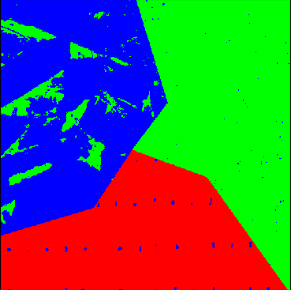
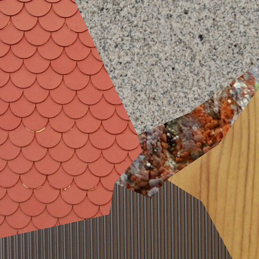
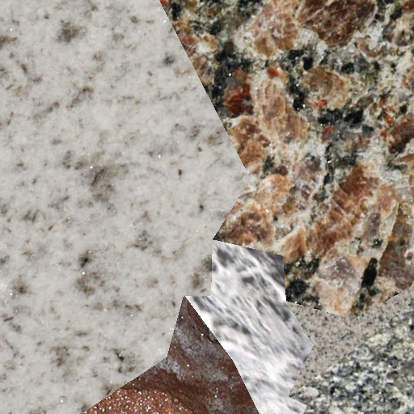
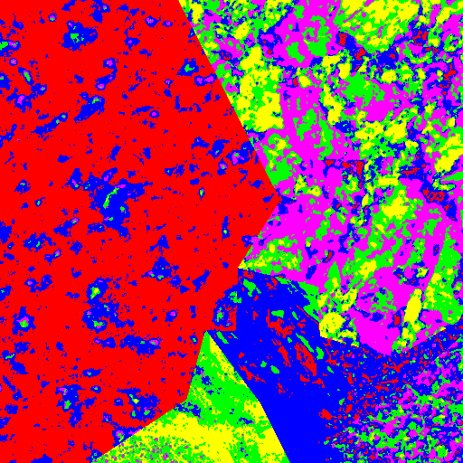
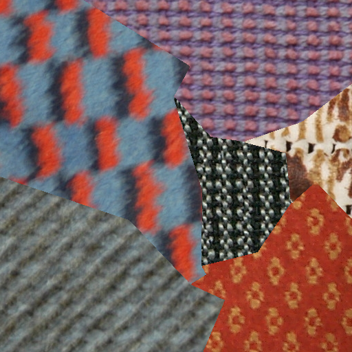
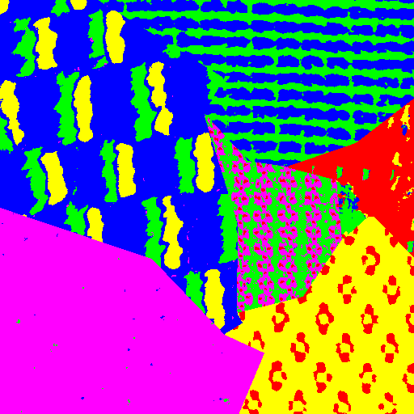
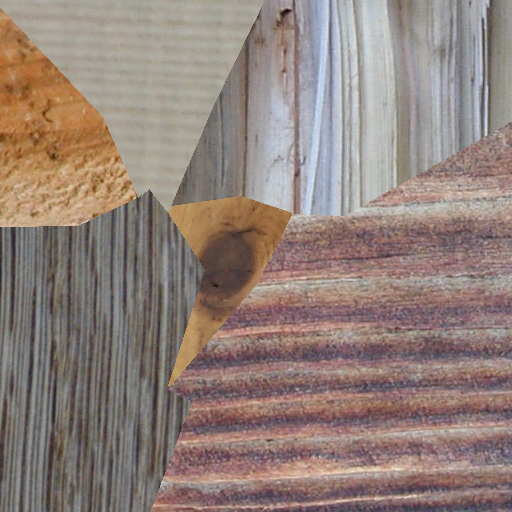
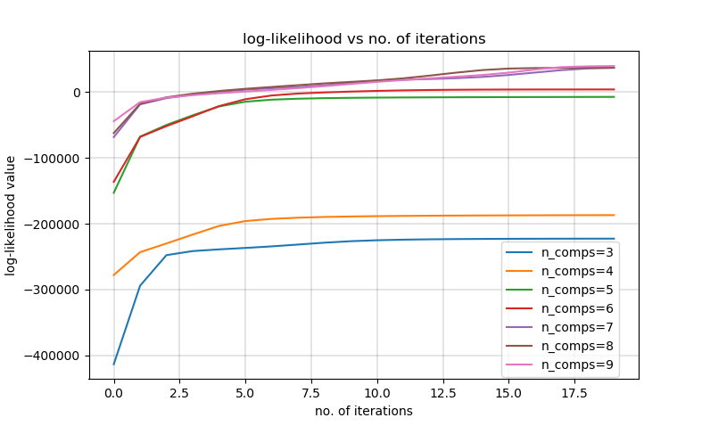

## Brief Overview

The basic idea of the code is to identify various textures or patterns from a given image. There are several images and each of those images have a mixture of various patterns. The task is to segment these various textures or to segregate them so that it can be easily understood that how the textures are different. For example, in the picture provided below, a human eye can clearly see and understand that there are 3 different patterns in the image and our task is to segment each of them individually such that each of the segmented mask can be used to select a particular pattern. However, the problem is not very trivial to be solved by a computer algorithm as the patterns, although are repeating -to an extent, can come in various types and sizes.

The method implemented to solve the problem is by using Gaussian Mixture of Models and Expectation Maximization.

### Sample Input / Output

Input Image           |  Output Image
:-------------------------:|:-------------------------:
   |   
  |  
  |  
  |  
  |  

### Plot of log-likelihood values vs number of components over 20 iterations

The log-likelihood values keeps on increasing with the increase in the number of components which is obvious but an indeal value of n_comps can be determined using the knee technique, i.e. checking the point of maximum reduction of variance for a particular value of n_comps . However, it has not been implemented in the code.

###Instructions to run the code:

Run the plot.py file to run the code. To obtain output for only a single value of n_comps - remove the loops in plot.py and just pass a single value of n_comp. Also the input to provide is in the deepcode.py file
